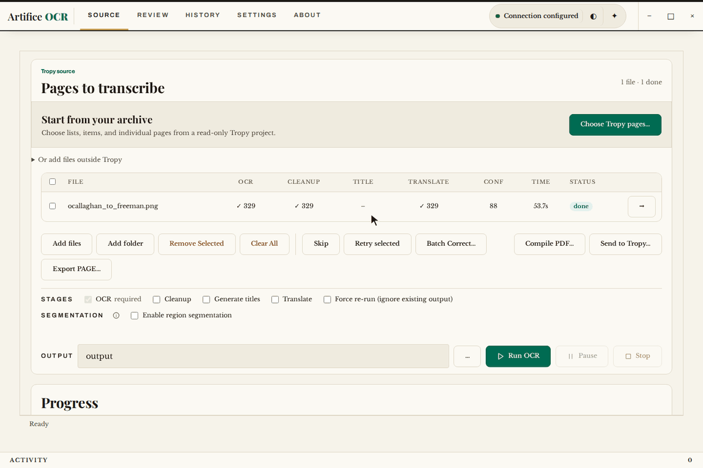

<p align="center">
  
</p>

<h1 align="center">Artifice OCR</h1>

<p align="center">
  <a href="https://github.com/MauriceJCasey/artifice-ocr/actions/workflows/safety-tests.yml"></a>
  <a href="https://api.reuse.software/info/github.com/MauriceJCasey/artifice-ocr"></a>
  <a href="LICENSE"></a>
  
</p>

A local-first OCR pipeline for historical documents that integrates with
[Tropy](https://github.com/tropy/tropy).

Artifice OCR, combined with a vision language model, reads scans and photographs. Optional
pre-processing breaks pages into segments. Cleanup and translate stages using models are also
supported. Easy-to-use editing tools make human-in-the-loop verification seamless.

Artifice OCR is designed with open source local models such as
[olmOCR](https://github.com/allenai/olmocr) and [Churro](https://github.com/stanford-oval/Churro)
in mind, and is particularly attuned to olmOCR-2. Nothing leaves your machine unless you point
it at a remote API yourself.

**⚠️ Active development, early stage.** Expect rough edges. This is for people comfortable
troubleshooting local models.

## What it does

- **OCR.** Reads scans and photographs of historical documents using a vision language model,
  such as olmOCR-2 or Churro.
- **Pre-processing.** Optional segmentation breaks a page into regions before OCR, useful for
  multi-column layouts, mixed print and marginalia, or bound volumes photographed two pages at
  a time.
- **Cleanup.** An optional model pass tidies up raw OCR noise (broken words, stray characters,
  layout artefacts) into readable text.
- **Translate.** An optional model pass translates the cleaned text.
- **Review.** Side-by-side scan and text comparison, in-place correction, a diff against the
  original OCR, and re-running later stages after a fix make human-in-the-loop verification
  straightforward rather than an afterthought.
- **Tropy integration.** Reads pages directly from a Tropy project and can write processed text
  and notes back to it.

Each stage runs against your own model server: Ollama, LM Studio, or anything OpenAI-compatible.

<p align="center">
  
</p>

## Download

Windows and Linux builds are attached to each
[release](https://github.com/MauriceJCasey/artifice-ocr/releases/latest). They are not code-signed
yet, and you still need a model server of your own (Ollama, LM Studio or anything
OpenAI-compatible).

**Windows 10 or 11**

1. Download `artifice-ocr-Windows-*.zip`, right-click it and choose **Extract All**. Keep the
   extracted folder together: the app needs the files beside it.
2. Open `artifice-ocr.exe`. Windows SmartScreen will say it "protected your PC" because the build
   is unsigned: choose **More info**, then **Run anyway**.
3. The app opens in its own window, and closing the window quits it.

**Linux (x86-64)**

```bash
mkdir artifice-ocr && tar -xzf artifice-ocr-Linux-*.tar.gz -C artifice-ocr
cd artifice-ocr && ./artifice-ocr --no-window
```

Then open `http://localhost:8765` in your browser, and press Ctrl+C in the terminal to stop it.
The `--no-window` flag is needed because a portable Linux build cannot bundle the system GTK
libraries that a native window uses.

**macOS** has no download yet: macOS will not open an unsigned app without extra steps, so use the
source install below.

## Run from source

```bash
uv sync --extra web
uv run artifice-ocr-web
```

This opens a local web interface at `http://localhost:8765`.

## License

AGPL-3.0-or-later. See [LICENSE](LICENSE).

<details>
<summary>Dependencies</summary>

<!-- BEGIN GENERATED DEPENDENCIES (see scripts/export-to-public-repos.sh) -->
## Dependencies

This list is generated directly from [`apps/artifice-ocr/pyproject.toml`](apps/artifice-ocr/pyproject.toml), the actual `dependencies`/`optional-dependencies` tables, not hand-maintained. `.github/workflows/dependency-guard.yml` fails the build if `uv.lock` ever drifts from this file, so any dependency change (including an unreviewed addition) shows up as an explicit, reviewable diff.

**Core:**

- `typer`
- `ollama`
- `openai`
- `python-dotenv`
- `pyyaml`
- `PyMuPDF`
- `Pillow`
- `numpy`
- `reportlab`
- `huggingface_hub`
- `artifice-secure-io>=0.2.0`
- `artifice-output-layout>=0.1.0`
- `artifice-shared-ui>=0.2.0`
- `artifice-model-harness>=0.2.0`
- `jinja2>=3.0`

**`web` extra:**

- `fastapi`
- `httpx>=0.27`
- `uvicorn[standard]`
- `python-multipart>=0.0.9`

**`window` extra:**

- `pywebview>=5.0`

**`segmentation-doclayout-yolo` extra:**

- `doclayout-yolo>=0.0.4`

**`segmentation-kraken` extra:**

- `kraken>=6.0.3,<7; python_version < '3.13'`

**`segmentation-diff-residual` extra:**

- `opencv-python-headless>=4.10`

**`segmentation` extra:**

- `artifice-ocr[segmentation-doclayout-yolo]`
- `artifice-ocr[segmentation-kraken]`
- `artifice-ocr[segmentation-diff-residual]`

For the complete resolved dependency tree (including transitive dependencies), see `uv.lock` at the repo root, or run `uv tree`.
<!-- END GENERATED DEPENDENCIES -->

</details>
